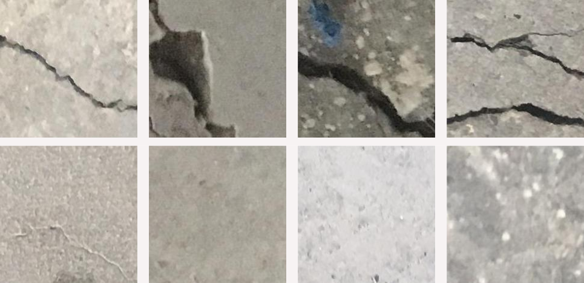

# CrackdetectTLGA
Crack detection plays a pivotal role in the maintenance and safety of infrastructure, including roads, bridges, and buildings, as timely identification of structural damage can prevent accidents and reduce costly repairs. Traditionally, manual inspection has been the norm, but it is labor-intensive, subjective, and hazardous. This paper introduces an advanced approach for crack detection in infrastructure using deep learning, leveraging transfer learning, spatial attention mechanisms, and genetic algorithm (GA) optimization. To address the challenge of the inaccessability of large amount of data, we employ ResNet50 as a pre-trained model, utilizing its strong feature extraction capabilities while reducing the need for extensive training datasets. We enhance the model with a spatial attention layer as well as a customized neural network which architecture was fine-tuned using GA. A comprehensive case study demonstrates the effectiveness of the proposed Attention-ResNet50-GA model, achieving great precision and F1-score, outperforming conventional methods. The results highlight the model’s ability to accurately detect cracks in various conditions, making it highly suitable for real-world applications where large annotated datasets are scarce.

# Data

Our data sources include the [Crack Forest Dataset (CFD)](https://github.com/cuilimeng/CrackForest-dataset), which consists of 155 images of urban concrete road cracks at an approximate resolution of 480 × 320 pixels, and the Concrete Crack Images for Classification Dataset (CCICD), featuring 20,000 images per class (crack and no-crack) at a resolution of 227 × 227 pixels in RGB format. Despite the availability of seemingly ample data, the CCICD images exhibit a high degree of homogeneity. This uniformity raises concerns about potential overfitting and inflated performance metrics during training and evaluation. To mitigate this issue, we selected a balanced subset of 6,000 images—3,000 per class—from various sources.

Our final dataset comprises a diverse range of images, including clear, low-light, and obstructed examples, ensuring a more representative depiction of real-world crack conditions. We categorized the images into two classes: "Negative" for images without cracks and "Positive" for images containing cracks. This mixed dataset blends actual field-collected data with existing databases, capturing diverse crack patterns such as linear, grid-like, and patch-like forms observed under different environmental conditions. By encompassing such variability, our dataset aims to enhance the model's adaptability to diverse real-world scenarios. To optimize computational efficiency, all images were resized to a standardized resolution of 224 × 224 pixels.

# Data Acquisition
The Crack Forest Dataset is available through the link above. The Concrete Crack Images for Classification Dataset (CCICD) can be obtained by running the script *crack_images/get_data.py*. Since CFD contains exclusively crack images, we choose to keep all of it and only sample the rest from CCICD.

# Models
The scripts for training and evaluating each model is under *models/*, where:

*CNN.py*: Trains and evaluates a convoluation neural network from our data.

*transfer_ResNet50.py*: Utilizes transfer learning by treating ResNet50 as baseline, and evaluate its performance on our data.

*Res_attention.py*: Adding spatial attention on top of the ResNet50.

*GA_algo.py*: Performing Genetic Algorithem(GA) to select optimial customized neural network parameters for the last section of the model.

*complete_model.py*: Trains and evalutes the ResNet50 with attention layer as well as the customized neural network optimized by GA.

For specific details, please refer to the method section of the paper.
